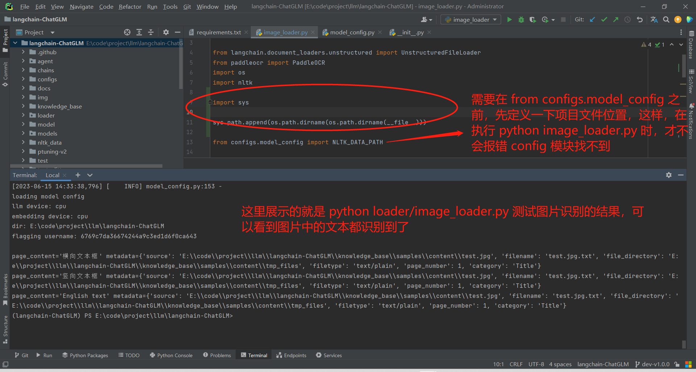
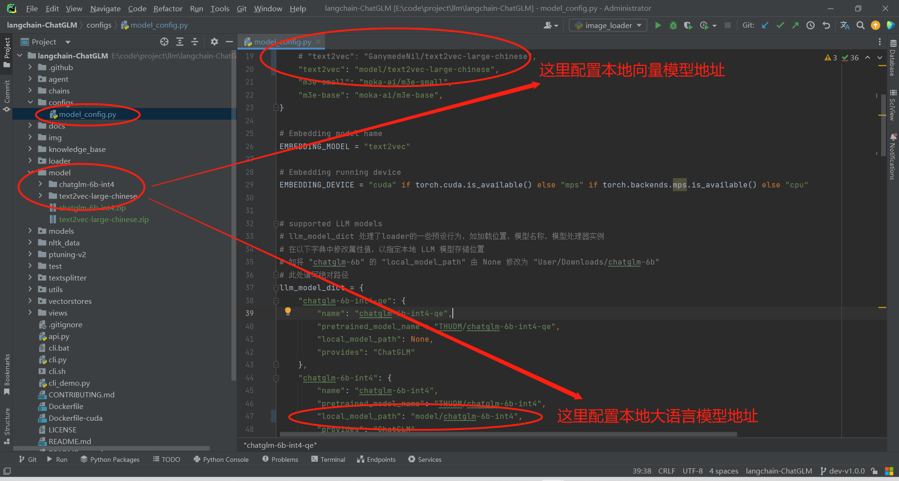
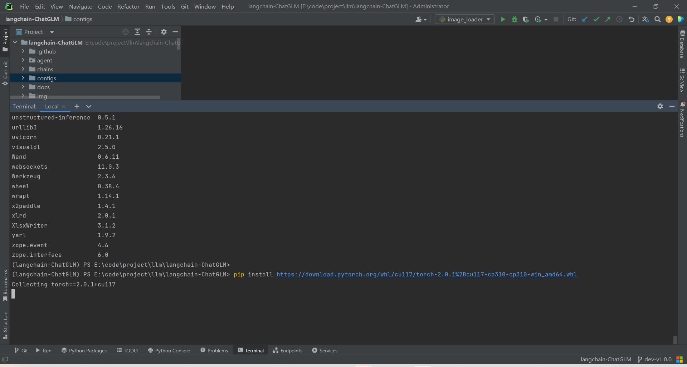
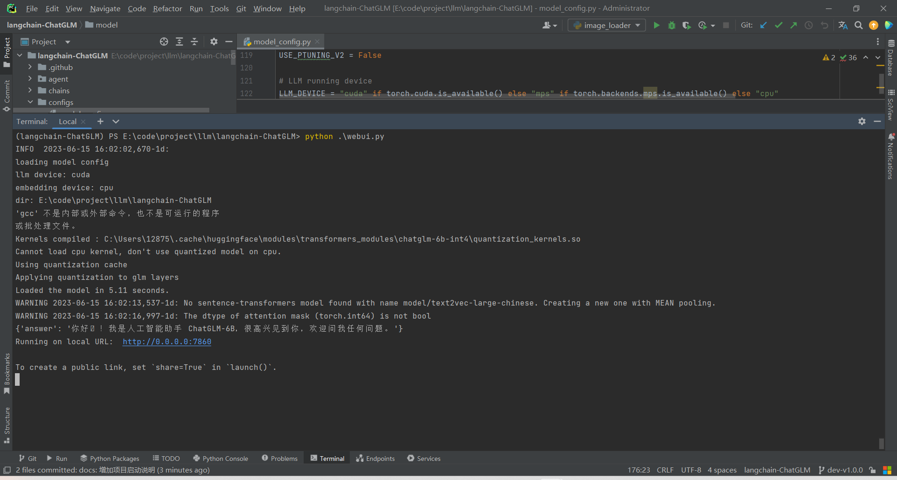

# langchain-chatglm学习笔记

## 项目部署

### 创建conda环境，并安装依赖

* 经测试，在 python3.10 环境下运行正常，因而这里以 python3.10 作为基础环境，对应的 cuda 使用 CUDA 11.7，另外，前端使用项目要求的 node18 环境并使用nvm进行版本切换

* 要更改conda创建环境的位置，你需要修改conda的配置文件。你可以通过以下步骤来实现这个目标：

  1. 打开命令行（Command Line）或者终端（Terminal）。
  2. 输入以下命令以添加新的环境目录：

  ```sh
  conda config --append envs_dirs D:/my-conda-envs
  ```

  这个命令将 `D:/my-conda-envs` 添加为新的环境目录。你可以将 `D:/my-conda-envs` 替换为你希望存储conda环境的任何目录。注意目录路径需要用斜杠（/）而非反斜杠（\）。

  1. 验证更改是否成功。输入以下命令：

  ```sh
  conda config --show envs_dirs
  ```

  如果你看到你刚刚添加的目录出现在列表中，那么你就已经成功更改了conda环境的存储位置。

  从现在开始，你使用 `conda create -n myenv` 命令创建的新环境将会在你指定的新目录下创建。

  请注意，此操作不会移动已经存在的conda环境，它只影响将来创建的环境。如果你希望移动已经存在的环境，你需要手动将它们移动到新的目录，并可能需要更新一些配置文件以反映这些更改。

  当你执行 `conda create -n myenv` 创建新环境时，conda会依次检查 `envs_dirs` 列表中的目录，看哪一个目录可以用于创建新环境。它会选择第一个有写权限且具有足够空间的目录来创建新环境。

  在你的例子中，conda会先检查 `C:\Users\12875\.conda\envs`，如果这个目录可以写且有足够空间，那么新环境就会在这里创建。如果这个目录不可写或者空间不足，conda会接着检查 `E:\code\env\miniconda\miniconda3\envs`，依此类推。

  如果你希望新环境被创建在特定的目录（比如 `E:\code\env\miniconda\miniconda3\envs`），你需要确保这个目录在 `envs_dirs` 列表中的位置在所有其它可写且有足够空间的目录之前。你可以通过 `conda config --prepend envs_dirs` 命令来将一个目录添加到列表的开始，比如：

  ```sh
  conda config --prepend envs_dirs E:/code/env/miniconda/miniconda3/envs
  ```

  这样，`E:\code\env\miniconda\miniconda3\envs` 就会被添加到 `envs_dirs` 列表的最前面，conda在创建新环境时会首先尝试在这个目录中创建。

  在使用 `conda create` 创建新环境时直接指定新环境的位置。你只需要在 `-n` 或 `--name` 选项后面提供一个完整的路径即可。例如：

  ```sh
  conda create --name /full/path/to/envs/myenv
  ```

  上述命令会在 `/full/path/to/envs/` 目录下创建一个名为 `myenv` 的新环境。请注意，你需要将 `/full/path/to/envs/` 替换为你希望存储新环境的实际路径。

  需要注意的是，当你这样做时，新创建的环境将不会自动出现在 `conda env list` 的列表中，因为它并没有被创建在 `envs_dirs` 配置选项所指定的任何一个目录下。如果你想要在 `conda env list` 的列表中看到这个新环境，你需要将新环境的父目录添加到 `envs_dirs` 配置选项中。

* 在 Windows 的命令提示符（cmd）中，你可以使用 `cd` 命令（Change Directory）来切换目录。例如，如果你想要切换到 `E:\code\project\llm\langchain-ChatGLM` 这个目录，你可以输入以下命令：

  ```sh
  cd /d E:\code\project\llm\langchain-ChatGLM
  ```

  这里的 `/d` 参数允许 `cd` 命令跨磁盘驱动器进行切换。如果你在同一磁盘驱动器中切换目录，你可以省略 `/d` 参数。

  请注意，目录路径中的斜杠（/）和反斜杠（\）在不同的操作系统和上下文中可能会有不同的含义。在 Windows 的命令提示符中，通常使用反斜杠（\）来分隔目录和文件名。

* 执行命令记录

  ```sh
  # 注意：以下操作最好在有管理员权限的 terminal 中执行，否则会报错没有权限，以下命令在用管理员打开的 cmd 中测试没有问题
  
  # 创建 python3.10 conda环境
  conda create -p E:/code/env/miniconda/miniconda3/envs/langchain-ChatGLM python=3.10
  # 激活 langchain-chatglm 环境
  conda activate langchain-ChatGLM
  # 安装项目依赖，在执行 pip install -r requirements.txt 时，若 requirements.txt 中，包含有中文，那么会有可能报错编码识别有问题，此时，只需要把中文的部分删除，再执行就行了。中文的部分通常是注释说明，所以它的存在是可以理解的。
  pip install --upgrade pip
  pip install -r requirements.txt
  # 验证paddleocr是否成功，首次运行会下载约18M模型到~/.paddleocr
  python loader/image_loader.py
  # 报错 ImportError: DLL load failed while importing _imaging: 找不到指定的模块
  # 错误提示显示 _imaging DLL（动态链接库）在导入时加载失败，找不到指定的模块。这是在试图导入 PIL（Python Imaging Library）模块时发生的，PIL 通常是由 Pillow 提供的，Pillow 是 PIL 的一个更活跃的分支。
  # 这个错误可能由以下原因导致：Pillow 或者其依赖的一些库没有被正确安装，需要卸载并安装 pillow
  # 重新安装 Pillow： 使用pip卸载并重新安装Pillow，以确保所有必要的库都已经被正确安装。你可以在你的命令行中运行以下命令：
  pip uninstall pillow
  pip install pillow
  # 若 python loader/image_loader.py 报错 ModuleNotFoundError: No module named 'configs'，那么是因为在代码中，需要预先配置当前项目路径，这可能是原来项目的代码bug，目前我已经在 dev-v1.0.0 中修复，具体参考问题记录
  
  # 可能需要安装pycocotools （对应pdf图片识别要用，可以遇到依赖问题再安装，后面有可能会优化这部分）
  # conda install -c conda-forge pycocotools
  ```

* 执行 python loader/image_loader.py 的结果示例

  

* 将pycharm中，langchain-chatglm项目对应的conda环境切换为这里配置的conda环境

  * File -> Settings -> Project:langchain-ChatGLM -> Add Interpreter -> Conda Envirenment -> Use existing envirenment -> 选择 langchain-ChatGLM

* 下载并安装对应 CUDA 11.7

  * 下载地址：

### 下载模型文件，配置读取本地模型

* 模型下载地址

  * 本地向量库
    * text2vec-large-chinese.zip 链接: https://pan.baidu.com/s/1sMyPzBIXdEzHygftEoyBuA?pwd=4xs7
  * 大语言模型
    * chatglm-6b-int4.zip 链接: https://pan.baidu.com/s/1pvZ6pMzovjhkA6uPcRLuJA?pwd=3gjd

* 在项目根目录下，创建新目录 model，把下载好的两个模型文件放到该目录下，并解压

  

* 下载GPU版本的 torch，用于在使用 CUDA 时，进行支持

  * Torch版本地址：https://download.pytorch.org/whl/torch_stable.html

  * 这里根据我的环境，选择下载

    * 执行 pip list ，可以查看当前环境中的 torch 版本为 2.0.1

    * 当前本地安装的 CUDA 为 11.7

    * python 3.10

    * 由上可知，对应我本地版本为：[cu117/torch-2.0.1%2Bcu117-cp310-cp310-win_amd64.whl](https://download.pytorch.org/whl/cu117/torch-2.0.1%2Bcu117-cp310-cp310-win_amd64.whl)

    * 执行安装：

      

### 启动项目

* 执行 python webui.py 启动服务

  * 启动成功的示例

    

* 启动中可能存在的问题

  * 报错多份OpenMP存在，此时，需要在全局配置允许多份存在

    * 报错内容示例：

      OMP: Error #15: Initializing libiomp5md.dll, but found libiomp5md.dll already initialized.
      OMP: Hint This means that multiple copies of the OpenMP runtime have been linked into the program. That is dangerous, since it can degrade performance or cause incorrect results. The b
      est thing to do is to ensure that only a single OpenMP runtime is linked into the process, e.g. by avoiding static linking of the OpenMP runtime in any library. As an unsafe, unsupport
      ed, undocumented workaround you can set the environment variable KMP_DUPLICATE_LIB_OK=TRUE to allow the program to continue to execute, but that may cause crashes or silently produce incorrect results. For more information, please see http://www.intel.com/software/products/support/.

    * 解决方案：

      * 在环境变量中设置 `KMP_DUPLICATE_LIB_OK=TRUE` 来临时解决这个问题。但是这个方法可能会导致程序崩溃或者产生错误的结果，因此只能作为临时解决方案。

        在 PowerShell 中，你可以使用下面的命令设置这个环境变量：

        ```sh
        $env:KMP_DUPLICATE_LIB_OK="TRUE"
        ```

    * 但是，更根本的解决方案是确保你的程序只链接了一份 OpenMP 库。这可能需要你检查你的 Python 环境中安装的所有库，并确保它们都是使用相同的 OpenMP 库编译的。这可能会涉及到重新编译一些库，或者在安装库的时候指定使用特定的 OpenMP 库。这里推测是 NumPy 和 PyTorch 造成的。在安装 pytorch gpu 版本时，单独走了另外的安装源，从而无法确保它们是从同一个源安装的，并且是兼容的版本，从而导致问题出现。
  * 显存不足

    * 由于 本地向量库 和 大语言模型 都会默认使用 gpu 中的显存，而这里用的向量模型大概需要 3G，大语言模型则需要6G，因而，若都用gpu则无法支撑，目前本地的显卡为 RTX2060 6G 显存

    * 解决方案：

      * 在 configs/model_config.py 中，配置 向量库的驱动直接使用cpu

        ```python
        # Embedding running device
        # EMBEDDING_DEVICE = "cuda" if torch.cuda.is_available() else "mps" if torch.backends.mps.is_available() else "cpu"
        EMBEDDING_DEVICE = "cpu"
        ```
  * 其他