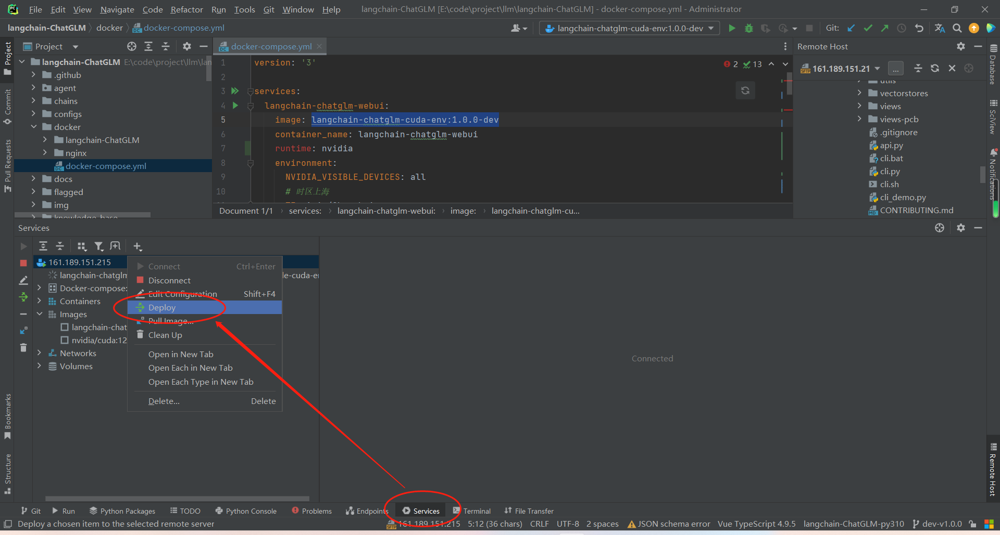
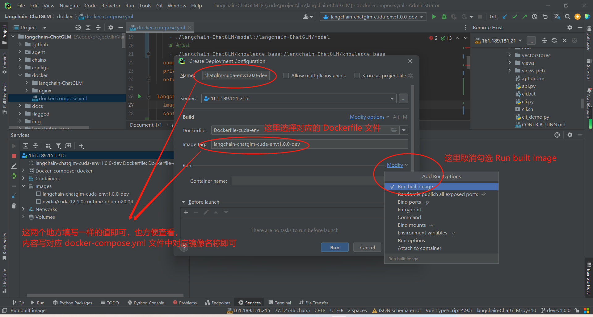
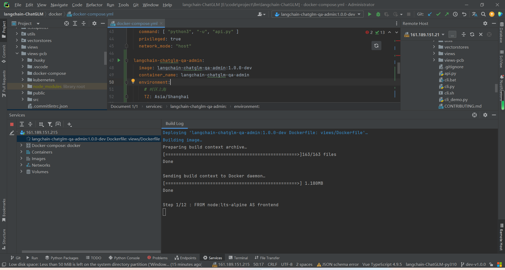

# langchain-chatglm学习笔记

## 项目部署

### 创建conda环境，并安装依赖

* 经测试，在 python3.10 环境下运行正常，因而这里以 python3.10 作为基础环境，对应的 cuda 使用 CUDA 11.7，另外，前端使用项目要求的 node18 环境并使用nvm进行版本切换

* 要更改conda创建环境的位置，你需要修改conda的配置文件。你可以通过以下步骤来实现这个目标：

  1. 打开命令行（Command Line）或者终端（Terminal）。
  2. 输入以下命令以添加新的环境目录：

  ```sh
  conda config --append envs_dirs D:/my-conda-envs
  ```

  这个命令将 `D:/my-conda-envs` 添加为新的环境目录。你可以将 `D:/my-conda-envs` 替换为你希望存储conda环境的任何目录。注意目录路径需要用斜杠（/）而非反斜杠（\）。

  1. 验证更改是否成功。输入以下命令：

  ```sh
  conda config --show envs_dirs
  ```

  如果你看到你刚刚添加的目录出现在列表中，那么你就已经成功更改了conda环境的存储位置。

  从现在开始，你使用 `conda create -n myenv` 命令创建的新环境将会在你指定的新目录下创建。

  请注意，此操作不会移动已经存在的conda环境，它只影响将来创建的环境。如果你希望移动已经存在的环境，你需要手动将它们移动到新的目录，并可能需要更新一些配置文件以反映这些更改。

  当你执行 `conda create -n myenv` 创建新环境时，conda会依次检查 `envs_dirs` 列表中的目录，看哪一个目录可以用于创建新环境。它会选择第一个有写权限且具有足够空间的目录来创建新环境。

  在你的例子中，conda会先检查 `C:\Users\12875\.conda\envs`，如果这个目录可以写且有足够空间，那么新环境就会在这里创建。如果这个目录不可写或者空间不足，conda会接着检查 `E:\code\env\miniconda\miniconda3\envs`，依此类推。

  如果你希望新环境被创建在特定的目录（比如 `E:\code\env\miniconda\miniconda3\envs`），你需要确保这个目录在 `envs_dirs` 列表中的位置在所有其它可写且有足够空间的目录之前。你可以通过 `conda config --prepend envs_dirs` 命令来将一个目录添加到列表的开始，比如：

  ```sh
  conda config --prepend envs_dirs E:/code/env/miniconda/miniconda3/envs
  ```

  这样，`E:\code\env\miniconda\miniconda3\envs` 就会被添加到 `envs_dirs` 列表的最前面，conda在创建新环境时会首先尝试在这个目录中创建。

  在使用 `conda create` 创建新环境时直接指定新环境的位置。你只需要在 `-n` 或 `--name` 选项后面提供一个完整的路径即可。例如：

  ```sh
  conda create --name /full/path/to/envs/myenv
  ```

  上述命令会在 `/full/path/to/envs/` 目录下创建一个名为 `myenv` 的新环境。请注意，你需要将 `/full/path/to/envs/` 替换为你希望存储新环境的实际路径。

  需要注意的是，当你这样做时，新创建的环境将不会自动出现在 `conda env list` 的列表中，因为它并没有被创建在 `envs_dirs` 配置选项所指定的任何一个目录下。如果你想要在 `conda env list` 的列表中看到这个新环境，你需要将新环境的父目录添加到 `envs_dirs` 配置选项中。

* 在 Windows 的命令提示符（cmd）中，你可以使用 `cd` 命令（Change Directory）来切换目录。例如，如果你想要切换到 `E:\code\project\llm\langchain-ChatGLM` 这个目录，你可以输入以下命令：

  ```sh
  cd /d E:\code\project\llm\langchain-ChatGLM
  ```

  这里的 `/d` 参数允许 `cd` 命令跨磁盘驱动器进行切换。如果你在同一磁盘驱动器中切换目录，你可以省略 `/d` 参数。

  请注意，目录路径中的斜杠（/）和反斜杠（\）在不同的操作系统和上下文中可能会有不同的含义。在 Windows 的命令提示符中，通常使用反斜杠（\）来分隔目录和文件名。

* 执行命令记录

  ```sh
  # 注意：以下操作最好在有管理员权限的 terminal 中执行，否则会报错没有权限，以下命令在用管理员打开的 cmd 中测试没有问题
  
  # 创建 python3.10 conda环境
  conda create -p E:/code/env/miniconda/miniconda3/envs/langchain-ChatGLM python=3.10
  # 激活 langchain-chatglm 环境
  conda activate langchain-ChatGLM
  # 安装项目依赖，在执行 pip install -r requirements.txt 时，若 requirements.txt 中，包含有中文，那么会有可能报错编码识别有问题，此时，只需要把中文的部分删除，再执行就行了。中文的部分通常是注释说明，所以它的存在是可以理解的。
  pip install --upgrade pip
  pip install -r requirements.txt
  # 验证paddleocr是否成功，首次运行会下载约18M模型到~/.paddleocr
  python loader/image_loader.py
  # 报错 ImportError: DLL load failed while importing _imaging: 找不到指定的模块
  # 错误提示显示 _imaging DLL（动态链接库）在导入时加载失败，找不到指定的模块。这是在试图导入 PIL（Python Imaging Library）模块时发生的，PIL 通常是由 Pillow 提供的，Pillow 是 PIL 的一个更活跃的分支。
  # 这个错误可能由以下原因导致：Pillow 或者其依赖的一些库没有被正确安装，需要卸载并安装 pillow
  # 重新安装 Pillow： 使用pip卸载并重新安装Pillow，以确保所有必要的库都已经被正确安装。你可以在你的命令行中运行以下命令：
  pip uninstall pillow
  pip install pillow
  # 若 python loader/image_loader.py 报错 ModuleNotFoundError: No module named 'configs'，那么是因为在代码中，需要预先配置当前项目路径，这可能是原来项目的代码bug，目前我已经在 dev-v1.0.0 中修复，具体参考问题记录
  
  # 可能需要安装pycocotools （对应pdf图片识别要用，可以遇到依赖问题再安装，后面有可能会优化这部分）
  # conda install -c conda-forge pycocotools
  ```

* 执行 python loader/image_loader.py 的结果示例

  

* 将pycharm中，langchain-chatglm项目对应的conda环境切换为这里配置的conda环境

  * File -> Settings -> Project:langchain-ChatGLM -> Add Interpreter -> Conda Envirenment -> Use existing envirenment -> 选择 langchain-ChatGLM

* 下载并安装对应 CUDA 11.7

  * 直接去英伟达官方下载，可以通过 google CUDA 11.7 download 直接到达下载页面
  * 下载地址：https://developer.nvidia.com/cuda-11-7-0-download-archive?target_os=Windows&target_arch=x86_64&target_version=11&target_type=exe_local

### 下载模型文件，配置读取本地模型

* 模型下载地址

  * 本地向量库
    * text2vec-large-chinese.zip 链接: https://pan.baidu.com/s/1sMyPzBIXdEzHygftEoyBuA?pwd=4xs7
  * 大语言模型
    * chatglm-6b-int4.zip 链接: https://pan.baidu.com/s/1pvZ6pMzovjhkA6uPcRLuJA?pwd=3gjd

* 在项目根目录下，创建新目录 model，把下载好的两个模型文件放到该目录下，并解压

  

* 下载GPU版本的 torch，用于在使用 CUDA 时，进行支持

  * Torch版本地址：https://download.pytorch.org/whl/torch_stable.html

  * 这里根据我的环境，选择下载

    * 执行 pip list ，可以查看当前环境中的 torch 版本为 2.0.1

    * 当前本地安装的 CUDA 为 11.7

    * python 3.10

    * 由上可知，对应我本地版本为：[cu117/torch-2.0.1%2Bcu117-cp310-cp310-win_amd64.whl](https://download.pytorch.org/whl/cu117/torch-2.0.1%2Bcu117-cp310-cp310-win_amd64.whl)

    * 执行安装：

      * pip install https://download.pytorch.org/whl/cu117/torch-2.0.1%2Bcu117-cp310-cp310-win_amd64.whl
      
      
      

### 启动项目

* 执行 python webui.py 启动服务

  * 启动成功的示例

    

* 启动中可能存在的问题

  * 报错多份OpenMP存在，此时，需要在全局配置允许多份存在

    * 报错内容示例：

      OMP: Error #15: Initializing libiomp5md.dll, but found libiomp5md.dll already initialized.
      OMP: Hint This means that multiple copies of the OpenMP runtime have been linked into the program. That is dangerous, since it can degrade performance or cause incorrect results. The b
      est thing to do is to ensure that only a single OpenMP runtime is linked into the process, e.g. by avoiding static linking of the OpenMP runtime in any library. As an unsafe, unsupport
      ed, undocumented workaround you can set the environment variable KMP_DUPLICATE_LIB_OK=TRUE to allow the program to continue to execute, but that may cause crashes or silently produce incorrect results. For more information, please see http://www.intel.com/software/products/support/.

    * 解决方案：

      * 在环境变量中设置 `KMP_DUPLICATE_LIB_OK=TRUE` 来临时解决这个问题。但是这个方法可能会导致程序崩溃或者产生错误的结果，因此只能作为临时解决方案。

        在 PowerShell 中，你可以使用下面的命令设置这个环境变量：

        ```sh
        $env:KMP_DUPLICATE_LIB_OK="TRUE"
        ```

    * 但是，更根本的解决方案是确保你的程序只链接了一份 OpenMP 库。这可能需要你检查你的 Python 环境中安装的所有库，并确保它们都是使用相同的 OpenMP 库编译的。这可能会涉及到重新编译一些库，或者在安装库的时候指定使用特定的 OpenMP 库。这里推测是 NumPy 和 PyTorch 造成的。在安装 pytorch gpu 版本时，单独走了另外的安装源，从而无法确保它们是从同一个源安装的，并且是兼容的版本，从而导致问题出现。

  * 显存不足

    * 由于 本地向量库 和 大语言模型 都会默认使用 gpu 中的显存，而这里用的向量模型大概需要 3G，大语言模型则需要6G，因而，若都用gpu则无法支撑，目前本地的显卡为 RTX2060 6G 显存

    * 解决方案：

      * 在 configs/model_config.py 中，配置 向量库的驱动直接使用cpu

        ```python
        # Embedding running device
        # EMBEDDING_DEVICE = "cuda" if torch.cuda.is_available() else "mps" if torch.backends.mps.is_available() else "cpu"
        EMBEDDING_DEVICE = "cpu"
        ```

## 线上环境部署

* 线上服务器拥有更大的显存且性能更强

* 服务器连接信息

  * langchain-ChatGLM

    * ec2-161-189-151-215.cn-northwest-1.compute.amazonaws.com.cn
    * 161.189.151.215

    * ubuntu
    * 秘钥文件：[ec2-for-pcb.pem](./langchain-chatglm学习笔记/服务器秘钥/ec2-for-pcb.pem)

  * 服务器显卡信息

    ```sh
    # 查看显卡信息
    (base) ubuntu@ip-172-31-15-150:/newdata/llm/project$ nvidia-smi
    Wed Jun 28 07:04:02 2023
    +-----------------------------------------------------------------------------+
    | NVIDIA-SMI 515.105.01   Driver Version: 515.105.01   CUDA Version: 11.7     |
    |-------------------------------+----------------------+----------------------+
    | GPU  Name        Persistence-M| Bus-Id        Disp.A | Volatile Uncorr. ECC |
    | Fan  Temp  Perf  Pwr:Usage/Cap|         Memory-Usage | GPU-Util  Compute M. |
    |                               |                      |               MIG M. |
    |===============================+======================+======================|
    |   0  Tesla T4            Off  | 00000000:00:1E.0 Off |                    0 |
    | N/A   45C    P0    27W /  70W |      0MiB / 15360MiB |      0%      Default |
    |                               |                      |                  N/A |
    +-------------------------------+----------------------+----------------------+
    
    +-----------------------------------------------------------------------------+
    | Processes:                                                                  |
    |  GPU   GI   CI        PID   Type   Process name                  GPU Memory |
    |        ID   ID                                                   Usage      |
    |=============================================================================|
    |  No running processes found                                                 |
    +-----------------------------------------------------------------------------+
    (base) ubuntu@ip-172-31-15-150:/newdata/llm/project$
    
    ```

* docker部署

  * 由于大语言模型一般都比较大，因而，若用docker部署，有可能面临需要修改docker存储镜像的位置，如下是修改步骤

      Docker 默认会在 "/var/lib/docker" 目录下存储其所有的数据，包括镜像、容器、卷和网络等。如果你想更改 Docker 的默认存储目录，可以通过以下步骤进行操作：
  
      1. **停止 Docker 服务**
  
         首先，你需要停止当前运行的 Docker 服务。在 Linux 系统中，可以使用以下命令：
  
         ```sh
         sudo systemctl stop docker
         ```
  
      2. **移动 Docker 数据**
  
         接下来，将 "/var/lib/docker" 目录下的数据移动到新的位置。例如，如果你想把 Docker 的数据存储到 "/mnt/new_disk/docker"，你可以使用以下命令：
  
         ```sh
         sudo mv /var/lib/docker /mnt/new_disk/docker
         ```
  
         注意替换 "/mnt/new_disk/docker" 为你的新的存储位置。
  
      3. **更新 Docker 配置**
  
         接下来，你需要更新 Docker 的配置，让 Docker 使用新的目录存储数据。你可以通过编辑 Docker 的服务配置文件来实现。在 Linux 系统中，Docker 的服务配置文件通常位于 "/etc/docker/daemon.json"。如果这个文件不存在，你可以创建一个新的。你需要在这个文件中添加一个 "data-root" 配置项，指向新的存储目录，如下所示：
  
         ```json
         {
             "data-root": "/mnt/new_disk/docker"
         }
         ```
  
         确保你将 "/mnt/new_disk/docker" 替换为你的新的存储位置。
  
      4. **重启 Docker 服务**
  
         最后，重新启动 Docker 服务，让新的配置生效：
  
         ```sh
         sudo systemctl start docker
         ```
  
      这样，Docker 就会在新的目录下存储其所有的数据了。请注意，这个过程需要管理员权限，所以在运行命令时可能需要使用 sudo。同时，确保在移动数据和更改配置时，新的存储位置有足够的磁盘空间，否则 Docker 可能会因为磁盘空间不足而无法运行。
  
  * 为了能让容器使用主机GPU资源，需要在主机上安装 [NVIDIA Container Toolkit](https://github.com/NVIDIA/nvidia-container-toolkit)。具体安装步骤如下：
  
      ```
      sudo apt-get update
      sudo apt-get install -y nvidia-container-toolkit-base
      sudo systemctl daemon-reload 
      sudo systemctl restart docker
      ```
  
  * 使用 git 拉取代码，若git拉取缓慢，建议直接打包本地代码，再到线上解压
  
  * 创建 model 目录，将 chatglm-6b-int4.zip 和 text2vec-large-chinese.zip 包放到model目录下
  
  * 在 langchain-ChatGLM 目录下，执行创建 docker 镜像的操作
  
    ```sh
    docker build -f Dockerfile-cuda-env -t langchain-chatglm-cuda-env:1.0.0-dev .
    ```
  
    * 这个 Docker 命令是用来构建一个 Docker 镜像的。我将为你详细解析这个命令：
  
      - `docker build`: 这是 Docker 的一个命令，用于从 Dockerfile 构建镜像。
      - `-f Dockerfile-cuda-env`: `-f` 参数后面接的是 Dockerfile 的文件名，这里的文件名是 `Dockerfile-cuda`。如果你不指定 `-f` 参数，Docker 会默认使用当前目录下名为 `Dockerfile` 的文件。
      - `-t clangchain-ChatGLM-cuda-env:1.0.0-dev`: `-t` 参数是用来给构建的镜像命名的。这里，镜像的名字是 `clangchain-ChatGLM-cuda-env`，标签（tag）是 `1.0.0-dev`。镜像的名字和标签之间用冒号隔开。如果你不指定标签，Docker 会默认使用 `latest` 作为标签。
      - `.`: 这个点表示 Dockerfile 所在的路径，这里是当前路径。Docker 会在这个路径下寻找 Dockerfile 并根据 Dockerfile 构建镜像。
  
      所以，这个命令的意思是在当前目录下，根据 `Dockerfile-cuda` 这个 Dockerfile，构建一个名为 `chatglm-cuda`，标签为 `latest` 的 Docker 镜像。
  
  * 在 langchain-ChatGLM 目录的 docker 目录下，有用于启动服务的 docker-compose.yml 文件 以及 对应 nginx 等的配置，可以将整个docker目录上传到服务器中，保持目录结构，在docker目录下，执行 docker compose up -d xxx 的命令启动服务
  
      * 由于使用到的镜像中，包含自定义创建的镜像，因而需要先确保对应镜像文件存在，后期也是通过更新镜像文件进行服务升级
  
          * 构建镜像
  
              * 这里使用pycharm中创建docker的 Service 来借助服务器中的docker服务，构建镜像
  
                  * 选择 Services ，在对应要进行镜像部署的docker连接上，右键，点击 Deploy
  
                      
  
                  * 填写镜像信息，镜像名称与 docker-compose.yml 中一致即可，选择对应 Dockerfile 文件，取消构建完成后立即运行，因为需要通过 docker compose 运行，才能进一步配置端口映射等信息
  
                      
  
                  * 配置好后，点击 apply ，然后 run 即可开始，因为需要将本地文件上传到服务器，因而在运行时，会有些慢
  
                      
  
              * 后端镜像使用项目根目录下的 Dockerfile-cuda-env 文件来构建，对应镜像的自定义名称和版本与docker-compose.yml中一致即可
  
              * 前端镜像使用 views 或 views-pcb 目录下的 Dockerfile 文件来构建，对应镜像的自定义名称和版本与docker-compose.yml中一致即可
              
              * 由于通过 pycharm 部署 docker 镜像时，后端部分文件过多，因而需要将代码提交后，在线上直接执行构建
              
                  ```sh
                  # 构建 langchain-chatglm cuda版本 镜像
                  docker build -f Dockerfile-cuda-env -t langchain-chatglm-cuda-env:1.0.0-dev .
                  
                  # 构建 langchain-chatglm 的 前端 qa 问答服务 镜像
                  docker build -f views/Dockerfile -t langchain-chatglm-qa-admin:1.0.0-dev .
                  
                  # 构建 pcb 对应的 前端 qa 问答服务 镜像
                  docker build -f views/Dockerfile -t langchain-chatglm-qa-pcb:1.0.0-dev .
                  
                  ```
              
                  
              
              * 其他
  
      * 启动 langchain-chatglm 的服务命令示例如下
  
          ```sh
          # 进入 docker 目录，通过 tree 命令，可以看到当前目录结构，当前目录也是容器映射数据卷的目录
          (base) ubuntu@ip-172-31-15-150:/newdata/llm/docker$ tree
          .
          ├── docker-compose.yml
          ├── langchain-ChatGLM
          │   ├── configs
          │   ├── knowledge_base
          │   └── model
          │       ├── chatglm2-6b
          │       │   ├── MODEL_LICENSE
          │       │   ├── README.md
          │       │   ├── config.json
          │       │   ├── configuration_chatglm.py
          │       │   ├── modeling_chatglm.py
          │       │   ├── pytorch_model-00001-of-00007.bin
          │       │   ├── pytorch_model-00002-of-00007.bin
          │       │   ├── pytorch_model-00003-of-00007.bin
          │       │   ├── pytorch_model-00004-of-00007.bin
          │       │   ├── pytorch_model-00005-of-00007.bin
          │       │   ├── pytorch_model-00006-of-00007.bin
          │       │   ├── pytorch_model-00007-of-00007.bin
          │       │   ├── pytorch_model.bin.index.json
          │       │   ├── quantization.py
          │       │   ├── tokenization_chatglm.py
          │       │   ├── tokenizer.model
          │       │   └── tokenizer_config.json
          │       ├── chatglm2-6b.zip
          │       ├── m3e-base
          │       │   ├── README.md
          │       │   ├── config.json
          │       │   ├── model.safetensors
          │       │   ├── pytorch_model.bin
          │       │   ├── special_tokens_map.json
          │       │   ├── tokenizer.json
          │       │   ├── tokenizer_config.json
          │       │   └── vocab.txt
          │       └── m3e-base.zip
          └── nginx
              ├── conf
              │   └── nginx.conf
              ├── html
              │   └── index.html
              └── htpasswd
                  ├── admin.htpasswd
                  └── pcb.htpasswd
          
          10 directories, 32 files
          
          
          # 启动 langchain-chatglm 的后端服务 webui.py
          docker compose up -d 
          ```
  
          
  
  * 执行 docker compose 命令，创建并启动容器
  
      ```sh
      docker compose up -d langchain-chatglm-api
      ```
  
      这里使用的 docker-compose.yml 内容中，包含有对应服务的启动命令，比如启动 webui 或 api 服务等
  
      
  
  * 为了在公网环境下尽可能的提供安全性，因此，这里通过配置nginx访问密码的方式来实现
  
      要求用户在访问Nginx服务时输入用户名和密码，你需要设置HTTP基本身份验证。以下是具体的步骤：
  
      1. 生成密码文件：Nginx使用的是Apache的 `htpasswd` 工具生成的密码文件，因此你需要首先安装Apache的工具包。使用下面的命令安装：
  
         对于 Ubuntu 或者 Debian：
  
         ```
         sudo apt-get install apache2-utils
         ```
  
         对于 CentOS 或者 RHEL：
  
         ```
         sudo yum install httpd-tools
         ```
  
         然后你可以使用下面的命令生成一个密码文件，将 `user` 替换为你想要的用户名，将 `/etc/nginx/.htpasswd` 替换为你想要存放密码文件的位置：
  
         ```
         sudo htpasswd -c /etc/nginx/.htpasswd user
         ```
  
         这将提示你输入密码。输入完成后，密码文件就生成好了。
  
      2. 修改Nginx配置：然后你需要在Nginx的配置文件中添加以下内容来启用HTTP基本身份验证：
  
         ```
         location / {
             auth_basic "Restricted"; # 开启验证并设置提示字符串
             auth_basic_user_file /etc/nginx/.htpasswd; # 密码文件位置
         }
         ```
  
         请根据你的实际情况修改上述配置。
  
      3. 这个时候，你需要在 docker-compose.yml 文件中映射这个密码文件以及nginx配置文件到nginx容器里。
  
         以下是一个 docker-compose.yml 文件的例子：
  
         ```
         bashCopy codeversion: '3'
         
         services:
           nginx:
             image: nginx:latest
             ports:
               - "81:80"
             volumes:
               - ./nginx.conf:/etc/nginx/nginx.conf:ro
               - ./path_to_your_htpasswd:/etc/nginx/.htpasswd:ro
         ```
  
         请确保将 `./path_to_your_htpasswd` 替换为你的 htpasswd 文件的实际路径，而且这个路径是在宿主机上的路径，不是在容器内的路径。然后将 `./nginx.conf` 替换为你的 nginx 配置文件的实际路径。
  
      4. 重启Nginx：最后，使用 docker-compose 来启动你的服务：
  
         ```
         Copy code
         docker-compose up -d
         ```
  
         现在，当用户尝试访问你的Nginx服务时，应该会提示他们输入用户名和密码。
  
  * 其他

## 使用问题记录

* 在使用知识库时，可能会由于给到 大语言模型 的 prompt 内容过多，导致显存溢出，此时，可以通过配置查询量来间接减少性能需求

  * 报错示例：

    * torch.cuda.OutOfMemoryError: CUDA out of memory. Tried to allocate 128.00 MiB (GPU 0; 6.00 GiB total capacity; 5.01 GiB already allocated; 0 bytes free; 5.28 GiB reserved in total by PyTorch) If reserved memory is >> allocated memory try setting max_split_size_mb to avoid fragmentation.  See documentation for Memory Management and PYTORCH_CUDA_ALLOC_CONF

  * 解决方案：

    * 在官方的 文档中也有说明，本质上也就是减小 prompt 内容

    * 在 configs/model_config.py 中，配置如下：

      ```py
      # 传入LLM的历史记录长度
      LLM_HISTORY_LEN = 2
      
      # 知识库检索时返回的匹配内容条数
      VECTOR_SEARCH_TOP_K = 3
      ```

      